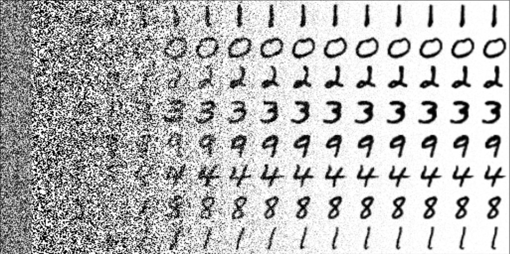

## Noise Conditional Score Network in 200 lines of code
 

NCSN is a precursor to score-based DDPM (diffusion models). The difference is that instead of reversing a single step of the process of partial data corruption, it attempts to reconstruct the original image directly from any noise level. This makes it easy to express in code and easy to understand.

But because the training objective is different from the sampling procedure (which is still the same as in diffusion models), NCSN models are unstable and hard to scale to high resolution images. Diffusion models address this gap.

Nevertheless, a simple implementation like this one is helpful to understand diffusion models and generative image models in general.

Sources:
1. [Song Y. and Ermon S. Generative Modeling by Estimating Gradients of the Data Distribution, 2019](https://arxiv.org/abs/1907.05600)
2. [Song Y. and Ermon S. Improved Techniques for Training Score-Based Generative Models, 2020](https://arxiv.org/abs/2006.09011)
